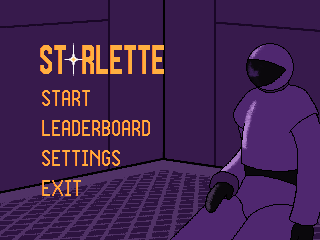
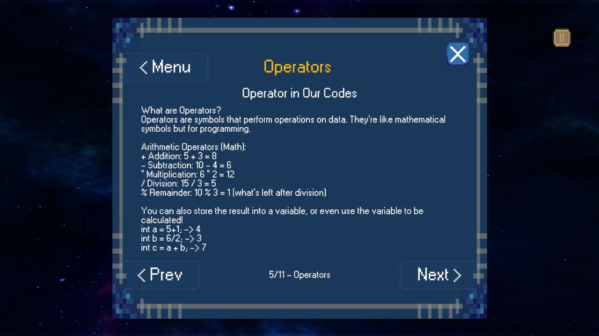
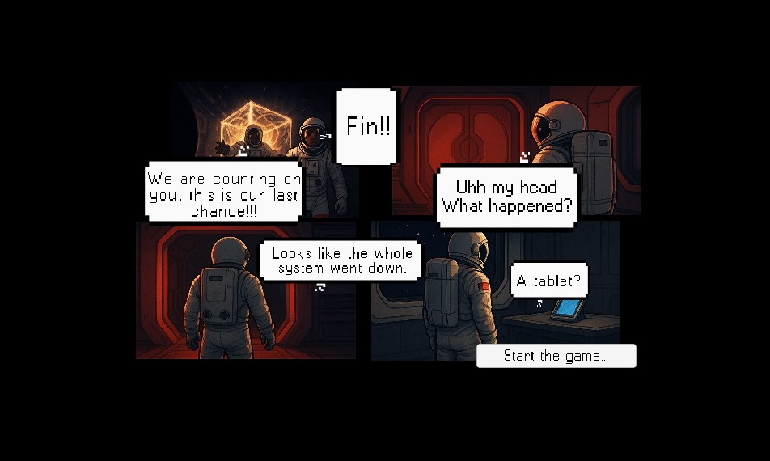
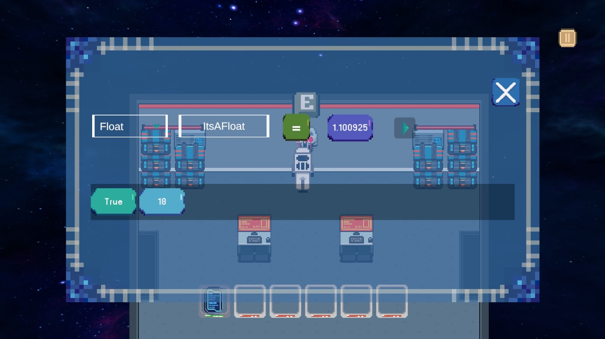

# 🌟 Starlette - An Educational Puzzle Game

**Starlette** is an engaging 2D escape room puzzle game that subtly teaches players programming logic through interactive challenges. Inspired by commercial-quality games, Starlette disguises learning in fun mechanics—perfect for players who "accidentally" learn while having fun!

---

## 🎮 Game Overview

> _"A game you play for fun, but end up learning to code!"_

Starlette places the player inside a mysterious digital lab where the only way out is through solving logic-based puzzles. The catch? Each puzzle represents a fundamental programming concept—like loops, conditionals, variables, and operators—all hidden beneath an intuitive block-based system.

---

## 🧩 Features

- 🧠 Logic puzzles that reflect actual programming constructs
- 🧱 Guided block-based coding system (similar to Scratch)
- 🎯 Progressively challenging levels
- 🔐 Account system with Firebase authentication
- 🎨 Clean UI/UX using Unity + React
- 🚀 Educational goals wrapped in fun gameplay

---

## 🖼️ Screenshots

<div align="center">
  <table>
    <tr>
      <td align="center"></td>
      <td align="center"></td>
    </tr>
    <tr>
      <td align="center"></td>
      <td align="center"></td>
    </tr>
  </table>
</div>

---

## 🛠️ Built With

- **Unity** – game engine for core game logic and visuals
- **Firebase** – user authentication and cloud data storage
- **Figma & Canva** – UI/UX prototyping

---

## 🚀 Getting Started

### 📦 Clone the Repository

```bash
git clone https://github.com/TazkieCT/starlette.git
cd starlette
```
### or install the game:
https://starlette-web-shxg.vercel.app/
